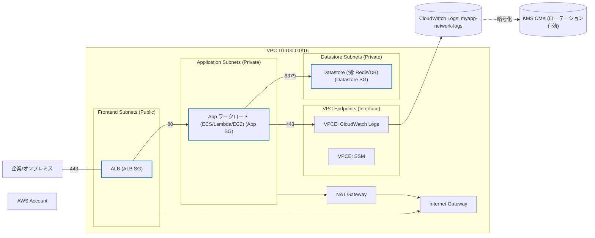

アーキテクチャ概要

概要
- 3 つのサブネットグループを持つ VPC（Frontend / Application / Datastore）
- Security Group と NACL により最小権限のベースラインを提供
- VPC Flow Logs は、スタック管理の KMS Key で暗号化された CloudWatch Logs へ配信
- Flow Logs 用 IAM Role は特定の LogGroup / LogStreams にスコープ

Mermaid 図（全体構成）

主要ポリシー
- KMS Key Policy は最小権限：特定の LogGroup に結びつけた Encryption Context、`GrantIsForAWSResource` による `CreateGrant` / `DescribeKey` の制限、アカウント root への `ViaService` 条件
