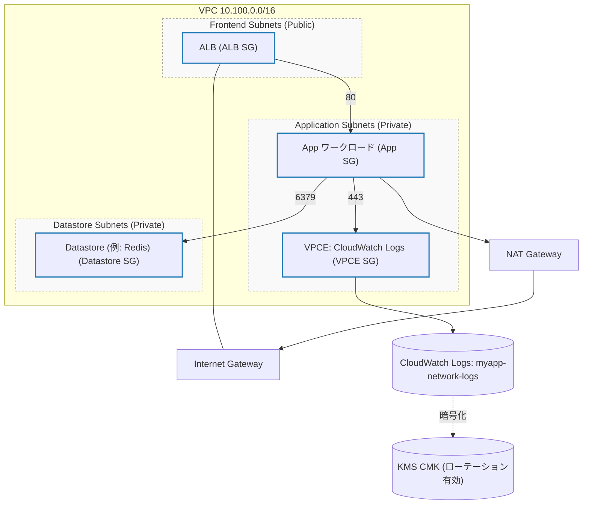

ネットワーク概要

VPC
- CIDR: 10.100.0.0/16
- サブネットグループ: Frontend / Application / Datastore（2 AZ 以上）

Internet / NAT
- Internet Gateway をアタッチ
- NAT Gateway を配置（1 つ以上）

Security Group
- ALB SG: 企業/オンプレミスのレンジからの 443 を許可
- App SG: ALB からの 80 のみ受信; 送信は VPCE SG:443 のみ
- VPCE SG: 受信なし; 送信は 443 のみ
- Datastore SG: App SG からの 6379 を許可

NACL（スケルトン）
- Frontend: 企業レンジのエフェメラルポートの入出力を許可
- Application: VPC 内からの 80/443 を受信許可; 送信はエフェメラル
- Datastore: VPC 内からの 6379 を受信許可; 送信はエフェメラル

Flow Logs
- 送信先: CloudWatch Logs の LogGroup `myapp-network-logs`
- 保持期間: 365 日
- 暗号化: KMS CMK（ローテーション有効）
- IAM Role: LogGroup / LogStreams に対して最小権限

Mermaid 図（ネットワーク構成）

