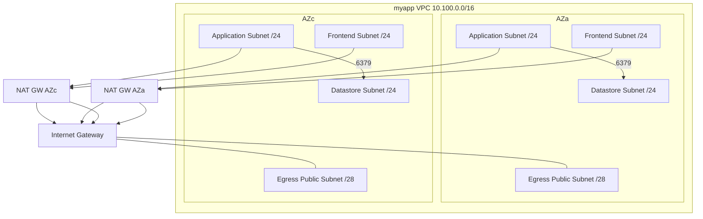

Network details (Mermaid diagrams)

通信・経路の概要（簡易）。

セキュリティ
- SG: ALB→App 80/443、App→Datastore 6379
- NACL: 各レイヤで最小権限の雛形（将来厳格化）

VPC Endpoints（例）
- Gateway: S3（全ステージ）
- Interface: ECR/ECR_DKR/Logs/STS/EC2/EC2Messages/ECS/ECS-Agent/ECS-Telemetry（全ステージ）
- Optional: Secrets Manager/SSM/SSM Messages/KMS、Gateway: DynamoDB（stage 切替）
